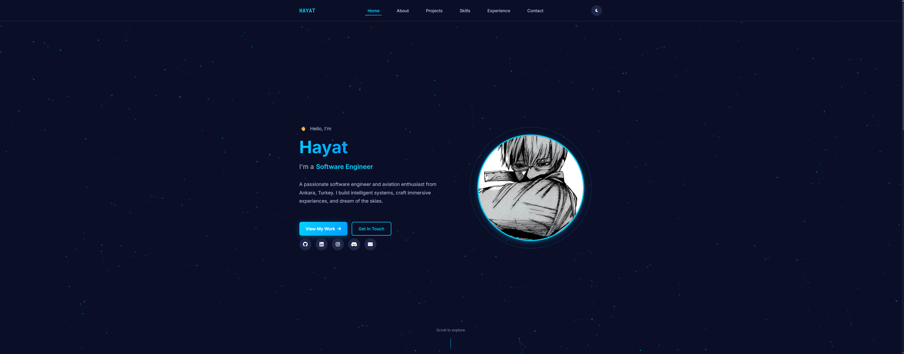

Markdown

<div align="center">

# 🌟 Hayat's Portfolio

### A Modern, Fast & Privacy-Focused Personal Website

[](https://hayatexe.com)
[](./LICENSE.md)
[](./CONTRIBUTING.md)

**[Live Demo](https://hayatexe.com)** • **[Report Bug](https://github.com/hayatexe/hayat-s-portfolio/issues)** • **[Request Feature](https://github.com/hayatexe/hayat-s-portfolio/issues)**



</div>

---

## 📖 Table of Contents

- [About](#-about)
- [Features](#-features)
- [Tech Stack](#-tech-stack)
- [Quick Start](#-quick-start)
- [Configuration](#-configuration)
- [Deployment](#-deployment)
- [Project Structure](#-project-structure)
- [Performance](#-performance)
- [SEO Features](#-seo-features)
- [License](#-license)
- [Contributing](#-contributing)
- [FAQ](#-faq)
- [Contact](#-contact)
- [Acknowledgments](#-acknowledgments)

---

## 🎯 About

A fast, modern, multi-page personal website built to showcase projects, skills, experience, and provide easy contact. Designed with performance, SEO, and privacy in mind.

### Why This Portfolio?

- ✅ **No Framework Bloat** – Pure HTML, CSS, JavaScript
- ✅ **Fast & Lightweight** – Optimized for performance
- ✅ **SEO Optimized** – Meta tags, Open Graph, JSON-LD schema
- ✅ **Privacy-Friendly** – Plausible analytics (no cookies)
- ✅ **Easy to Customize** – Well-organized, documented code
- ✅ **Dual-Licensed** – GPL-3.0 or Commercial use available

---

## ✨ Features

### 🎨 User Experience
- **Multi-page Architecture** – Home, About, Projects, Skills, Experience, Contact
- **Dark/Light Theme Toggle** – System preference detection with manual override
- **Smooth Animations** – GSAP-powered scroll reveals and interactions
- **Particle Hero Section** – Canvas-based animated background
- **Responsive Design** – Mobile-first, works on all devices

### 🚀 Performance & SEO
- **Clean URLs** – `/about` instead of `/about.html`
- **Optimized Assets** – Compressed images, minified CSS/JS
- **Fast Load Times** – Minimal dependencies, async loading
- **SEO-Ready** – Per-page meta tags, canonical links, sitemap.xml
- **Progressive Web App** – Web App Manifest, favicons

### 📧 Contact Form
- **EmailJS Integration** – No backend required
- **Real-time Validation** – Client-side form validation
- **Auto-save Drafts** – LocalStorage backup
- **Spam Protection** – Honeypot field + time-based validation
- **Success Confetti** – Delightful user feedback

### 🔒 Security & Privacy
- **No Tracking Cookies** – Plausible analytics
- **External Link Hardening** – `rel="noopener noreferrer nofollow"`
- **Environment Variables** – Sensitive data separated
- **CSP Ready** – Content Security Policy compatible

---

## 🛠️ Tech Stack

| Category | Technologies |
|----------|-------------|
| **Frontend** | HTML5, CSS3 (Grid, Flexbox, Custom Properties) |
| **JavaScript** | Vanilla ES6+ |
| **Animations** | GSAP 3.x + ScrollTrigger |
| **Email Service** | EmailJS |
| **Analytics** | Plausible.io |
| **Server** | Apache/LiteSpeed (.htaccess) |
| **Hosting** | Compatible with Netlify, Vercel, GitHub Pages, cPanel |

---

## 🚀 Quick Start

### Prerequisites

- Git installed
- A code editor (VS Code recommended)
- Live Server extension (for local development)
- An EmailJS account (free tier available)

### 1️⃣ Clone the Repository

```bash
git clone https://github.com/hayatexe/hayat-s-portfolio.git
cd hayat-s-portfolio
```


### 2️⃣ Set Up Configuration
Windows (PowerShell):
```bash
Copy-Item config.example.js config.js
Copy-Item .env.example .env
```
Mac/Linux:
```bash
cp config.example.js config.js
cp .env.example .env
```
3️⃣ Configure EmailJS
Sign up at EmailJS (free tier available)

Add an Email Service:

Go to Email Services → Add New Service
Choose your provider (Gmail, Outlook, etc.)
Connect your email account
Copy your Service ID
Create an Email Template:

Go to Email Templates → Create New Template
Add these template variables:
```text
From: {{from_name}}
Email: {{from_email}}
Subject: {{subject}}
Message: {{message}}
Reply To: {{reply_to}}
```
Copy your Template ID
Get Your Public Key:

Go to Account → General
Copy your Public Key
Update config.js:

```JavaScript

emailjs: {
    publicKey: 'YOUR_PUBLIC_KEY_HERE',
    serviceId: 'YOUR_SERVICE_ID_HERE',
    templateId: 'YOUR_TEMPLATE_ID_HERE',
},
contact: {
    email: 'your-email@example.com'
}
```
4️⃣ Run Locally
Option A: VS Code Live Server (Recommended)
Install the Live Server extension in VS Code
Right-click index.html → Open with Live Server
Visit http://127.0.0.1:5500/

Option B: Python
```Bash
python -m http.server 8000
# Visit http://localhost:8000/
```
Option C: Node.js
```Bash
npx http-server -p 8000
# Visit http://localhost:8000/
```
5️⃣ Customize Content
Edit these files to personalize your portfolio:
```
index.html – Home page hero section
about.html – Your bio and story
projects.html – Your projects showcase
skills.html – Your technical skills
experience.html – Work history and education
contact.html – Contact form (already configured)
```
Update assets:
```
Replace assets/profile.jpg with your photo
Update favicons in assets/favicon/
Modify colors in css/theme.css
```
```⚙️ Configuration
Configuration Files
File	Purpose	Committed?
config.example.js	Example configuration template	✅ Yes
config.js	Your actual configuration with secrets	❌ No (.gitignore)
.env.example	Environment variables example	✅ Yes
.env	Your environment variables	❌ No (.gitignore)
```
Security Notice
⚠️ Never commit these files:

config.js – Contains your EmailJS credentials
.env – Contains sensitive environment variables
These files are already listed in .gitignore to prevent accidental commits.

Customization Options
Edit config.js to customize:

```JavaScript

// Validation rules
validation: {
    minNameLength: 2,           // Minimum name characters
    minMessageLength: 10,       // Minimum message characters
    minFormTime: 3000,          // Anti-spam delay (ms)
},

// UI timing
ui: {
    statusDisplayDuration: 10000,  // Success message duration
    confetti: {
        count: 50,                  // Number of confetti particles
        colors: ['#00d4ff', '#0099ff', '#ff0080', '#00ff88', '#ffaa00']
    }
},

// Autosave
autosave: {
    debounceTime: 1000,            // Save delay (ms)
    storageKey: 'contactFormDraft' // LocalStorage key
}
```
🌐 Deployment
GitHub Pages
Go to Settings → Pages
Source: Deploy from main branch
Click Save
Your site will be live at: https://hayatexe.github.io/hayat-s-portfolio/
⚠️ Note: Create config.js manually with your EmailJS credentials after deployment.
📁 Project Structure
```text

hayat-s-portfolio/
├── 📄 index.html              # Home page
├── 📄 about.html              # About page
├── 📄 projects.html           # Projects showcase
├── 📄 skills.html             # Skills & technologies
├── 📄 experience.html         # Work & education
├── 📄 contact.html            # Contact form
│
├── 📂 css/
│   ├── theme.css              # CSS variables & themes
│   ├── style.css              # Main styles
│   └── animations.css         # Animation styles
│
├── 📂 js/
│   ├── main.js                # Core JavaScript
│   ├── theme.js               # Theme switcher
│   ├── animations.js          # GSAP animations
│   ├── contact.js             # Contact form handler
│   └── config.js              # Configuration (gitignored)
│
├── 📂 assets/
│   ├── profile.jpg            # Your photo
│   ├── site.png               # Screenshot
│   ├── ALICE.jpg              # Project image
│   └── favicon/               # All favicon sizes
│
├── 📄 .env.example            # Environment variables template
├── 📄 config.example.js       # Configuration template
├── 📄 setup.MD                # Detailed setup guide
├── 📄 CLA.MD                  # Contributor License Agreement
├── 📄 CONTRIBUTING.md         # Contribution guidelines
├── 📄 LICENSE.md              # GPL-3.0 license
├── 📄 COMMERCIAL_LICENSE.md   # Commercial license
├── 📄 NOTICE.md               # Attribution notices
├── 📄 .gitignore              # Git ignore rules
├── 📄 .htaccess               # Apache/LiteSpeed config
├── 📄 robots.txt              # Search engine directives
├── 📄 sitemap.xml             # XML sitemap
├── 📄 site.webmanifest        # PWA manifest
└── 📄 README.md               # This file
```
📊 Performance
Lighthouse Score: 95+ (Performance, Accessibility, Best Practices, SEO)
First Contentful Paint: < 1s
Time to Interactive: < 2s
Total Bundle Size: < 500KB (including GSAP)
🔍 SEO Features
✅ Semantic HTML5 markup
✅ Meta description on every page
✅ Open Graph tags (Facebook, LinkedIn)
✅ Twitter Card tags
✅ JSON-LD structured data (Person schema)
✅ Canonical URLs
✅ XML sitemap (sitemap.xml)
✅ robots.txt configuration
✅ Optimized images with alt text
✅ Fast load times
✅ Mobile-friendly responsive design
📜 License
This project is dual-licensed. You may choose either:

Option 1: GPL-3.0-or-later (Open Source)
You may use, modify, and distribute this project under the GNU General Public License v3.0 or later.

✅ Commercial use allowed (with GPL compliance)
✅ Modify and distribute (must share source code)
✅ Patent grant included
⚠️ Must disclose source when distributing
⚠️ Same license for derivatives (copyleft)
Read Full GPL-3.0 License →

Option 2: Commercial License
For closed-source or proprietary use without GPL obligations:

✅ Keep modifications private
✅ Use in proprietary projects
✅ No copyleft requirements
💼 Requires separate commercial agreement
Contact: hayatexeler@gmail.com

Read Commercial License Terms →

🤝 Contributing
We welcome contributions! To maintain dual-licensing:

Read CONTRIBUTING.md and CLA.MD
Fork the repository
Create a feature branch (git checkout -b feature/AmazingFeature)
Commit your changes (git commit -m 'Add some AmazingFeature')
Push to the branch (git push origin feature/AmazingFeature)
Open a Pull Request
Agree to the CLA (checkbox in PR template)
Development Guidelines
Follow existing code style
Add comments for complex logic
Test on multiple browsers (Chrome, Firefox, Safari, Edge)
Update documentation if needed
Add the SPDX header to new files:
```
/*
 * Copyright (c) 2025 Hayat
 * SPDX-License-Identifier: GPL-3.0-or-later OR LicenseRef-Hayat-Commercial
 */
```
🐛 Known Issues
GitHub Pages: Requires manual config.js creation (can't deploy secrets)
Safari < 14: Some CSS features may need fallbacks
IE 11: Not supported (use modern browsers)
See Issues for more.

🗺️ Roadmap
 Add blog section with markdown support
 Implement syntax highlighting for code blocks
 Add multilingual support (English/Turkish)
 Create admin panel for content management
 Add unit tests for JavaScript modules
 Integrate alternative analytics options
 Add RSS feed for blog posts
 Create detailed project case study pages
 Add accessibility audit improvements
 Implement service worker for offline support
💡 FAQ
<details> <summary><strong>Why vanilla JavaScript instead of React/Vue?</strong></summary> <br> For a portfolio website, vanilla JS provides:
⚡ Faster load times (no framework overhead)
🎯 Better SEO (no hydration issues)
🚀 Simpler hosting (just static files)
🔧 Easier maintenance (no dependency updates)
📦 Smaller bundle size
</details><details> <summary><strong>Can I use this for commercial projects?</strong></summary> <br> Yes! You have two options:
Use under GPL-3.0 (free, open-source)

You must share your source code
Derivatives must use same license
Get a commercial license

Keep your modifications private
No copyleft obligations
Contact: hayatexeler@gmail.com
</details><details> <summary><strong>How do I update my EmailJS credentials?</strong></summary> <br> Edit <code>config.js</code> (not <code>config.example.js</code>):

  ```JavaScript

emailjs: {
    publicKey: 'YOUR_NEW_PUBLIC_KEY',
    serviceId: 'YOUR_NEW_SERVICE_ID',
    templateId: 'YOUR_NEW_TEMPLATE_ID',
}
```
Important: Never commit config.js to GitHub! It's already in .gitignore.

</details><details> <summary><strong>Is my contact form secure?</strong></summary> <br> Yes! Security features include:
✅ Client-side validation
✅ Honeypot spam protection
✅ Time-based submission check
✅ EmailJS rate limiting
✅ No database (no SQL injection risk)
✅ HTTPS encryption (when deployed)
✅ CSP-ready architecture
</details><details> <summary><strong>How do I change the theme colors?</strong></summary> <br> Edit <code>css/theme.css</code> and modify the CSS custom properties:

  ```CSS

:root {
    --primary-color: #your-color;
    --secondary-color: #your-color;
    --accent-color: #your-color;
}
```
The theme switcher will automatically apply these colors to both light and dark modes.

</details><details> <summary><strong>Can I remove the attribution?</strong></summary> <br> Under the GPL-3.0 license, you must keep the copyright notices and license information.
For attribution-free use, you need a commercial license. Contact: hayatexeler@gmail.com

</details>
📞 Contact
Hayat – @hayatexe

🌐 Website: hayatexe.com
📧 Email: hayatexeler@gmail.com
💼 LinkedIn: linkedin.com/in/hayat
🐦 Twitter: @hayatexe
🙏 Acknowledgments
GSAP – Powerful animation library
EmailJS – Email service for contact forms
Plausible – Privacy-friendly analytics
Font Awesome – Icon library
Google Fonts – Web typography
⭐ Show Your Support
If this project helped you, please consider:

⭐ Star this repository
🐛 Report bugs or request features via Issues
🤝 Contribute improvements via Pull Requests
💬 Share with others who might find it useful
📝 Write a blog post or tutorial about it
<div align="center">
Made with ❤️ by Hayat

© 2025 Hayat. Licensed under GPL-3.0-or-later OR Commercial License.

GitHub Stars
GitHub Forks
GitHub Issues
GitHub Pull Requests

⬆ Back to Top

</div> ```
